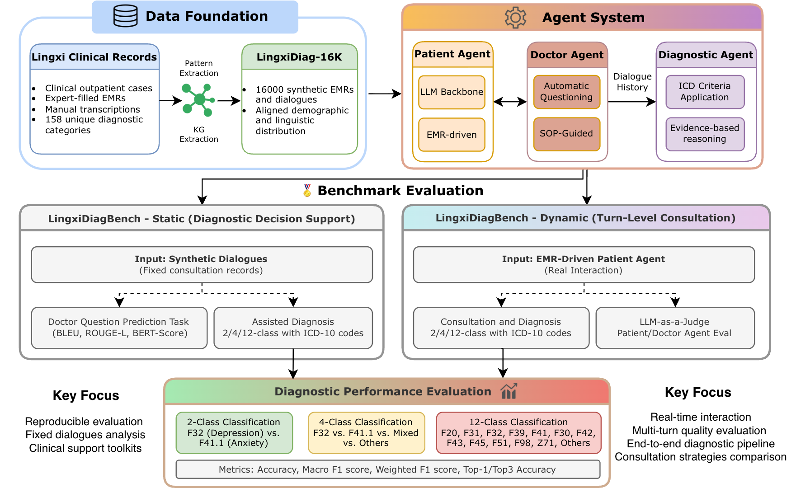

<div align="center">

<h1>
  🧠 LingxiDiagBench
</h1>

<p><strong>A Comprehensive Benchmark for Psychiatric Diagnosis with LLM-Based Doctor-Patient Agents</strong></p>

<p>
  
  
  
  
  <a href="https://huggingface.co/datasets/XuShihao6715/LingxiDiag-16k"></a>
</p>

<p>
  <a href="README.md">English</a> | <a href="README_zh.md">简体中文</a>
</p>

</div>

---

## 📖 Overview

**LingxiDiagBench** is a comprehensive benchmark for evaluating LLM-based psychiatric diagnosis capabilities. It provides both static (fixed dialogue) and dynamic (real-time interaction) evaluation protocols, enabling systematic assessment of AI-assisted diagnostic decision support systems.

<div align="center">
  
  <p><em>Figure: LingxiDiagBench Architecture - Data Foundation, Agent System, and Benchmark Evaluation</em></p>
</div>

### Key Components

| Component | Description |
|-----------|-------------|
| **[LingxiDiag-16K](https://huggingface.co/datasets/XuShihao6715/LingxiDiag-16k)** | 16,000 synthetic EMRs and dialogues with aligned demographic distribution |
| **LingxiDiagBench-Static** | Fixed dialogue analysis for diagnostic decision support |
| **LingxiDiagBench-Dynamic** | Real-time interaction with EMR-driven patient agents |

### Evaluation Tasks

- **Assisted Diagnosis**: 2-class (Depression vs. Anxiety), 4-class (+ Mixed + Others), 12-class (ICD-10 categories)
- **Doctor Question Prediction**: BLEU, ROUGE-L, BERTScore
- **LLM-as-Judge**: Clinical appropriateness, Ethics, Assessment quality
- **Metrics**: Accuracy, Macro F1, Weighted F1, Top-1/Top-3 Accuracy

---

## 🚀 Quick Start

### Prerequisites

- **Python**: 3.10+
- **OS**: Linux / macOS / Windows
- **GPU**: Optional (required for local VLLM deployment)

### Installation

#### 1. Clone Repository

```bash
git clone https://github.com/Lingxi-mental-health/LingxiDiagBench.git
cd LingxiDiagBench
```

#### 2. Install Dependencies with uv

```bash
# Install uv (if not installed)
pip install uv

# If in conda environment, deactivate first
conda deactivate

# Create virtual environment
uv venv

# Activate virtual environment
source .venv/bin/activate  # Linux/macOS
# or
.venv\Scripts\activate     # Windows

# Verify environment
which python  # Should show .venv/bin/python
which pip     # Should show .venv/bin/pip

# Install project and dependencies
uv pip install -e .

# Install vLLM
uv pip install vllm --torch-backend=auto

```

#### 3. Configure Environment

```bash
# Copy environment template
cp .env_example .env

# Edit .env file with your configuration
```

Key environment variables:

```bash
# === OpenRouter API ===
OPENROUTER_API_KEY=sk-or-v1-your-key

# === DeepInfra API (for RAG embedding) ===
DEEPINFRA_API_KEY=your_deepinfra_api_key
USE_DEEPINFRA_EMBEDDING=true
DEEPINFRA_EMBEDDING_MODEL=Qwen/Qwen3-Embedding-8B
ENABLE_RERANKING=false
```

#### 4. Download Dataset

Download the [LingxiDiag-16K](https://huggingface.co/datasets/XuShihao6715/LingxiDiag-16k) dataset to the `raw_data/` directory:

```bash
python scripts/huggingface_download.py \
    --repo-name "XuShihao6715/LingxiDiag-16k" \
    --output-dir "./raw_data" \
    --token "your_huggingface_token"
```

> **Note**: Replace `your_huggingface_token` with your Hugging Face access token. You can also set the `HF_TOKEN` environment variable instead of using `--token`.

Available options:

| Option | Description | Default |
|--------|-------------|---------|
| `--repo-name` | HF repository name (required) | — |
| `--output-dir` | Output directory | `./downloaded_data` |
| `--token` | HF access token (or set `HF_TOKEN` env var) | `None` |
| `--split` | Download specific split: `train` / `validation` / `test` | All splits |
| `--format` | Output format: `list` / `data_wrapper` / `lines` | `list` |
| `--no-mirror` | Disable hf-mirror acceleration | Mirror enabled |

---

## 📚 Pre-requisites for Doctor V3 (RAG-Enhanced)

Doctor V3 uses RAG (Retrieval-Augmented Generation) for evidence-based consultation. Before running evaluations with Doctor V3, you need to build the knowledge base.

### 1. Configure DeepInfra API

```bash
export DEEPINFRA_API_KEY=your_deepinfra_api_key
export USE_DEEPINFRA_EMBEDDING=true
export DEEPINFRA_EMBEDDING_MODEL=Qwen/Qwen3-Embedding-8B
export ENABLE_RERANKING=false
```

### 2. Build Knowledge Base

```bash
# Build FAISS index from clinical guidelines PDF
python scripts/build_knowledge_base.py \
    --pdf knowledge_base/doc/疾病诊断指南.pdf \
    --output knowledge_base/indices/faiss_index
```

This creates vector embeddings for retrieval during consultation.

---

## 🔬 Reproducing Paper Results

### Overview of Evaluation Scripts

| Script | Purpose |
|--------|---------|
| `evaluation/batch_patient_eval.py` | Patient Agent evaluation (Table 3) |
| `evaluation/batch_doctor_eval.py` | Dynamic benchmark evaluation (Table 7) |
| `evaluation/unified_doctor_eval.py` | Static benchmark evaluation (Tables 4, 5, 6) |

### Table 3: Patient Agent Evaluation

Evaluates patient agent quality across behavioral authenticity dimensions.

```bash
bash run_patient_eval.sh
```

### Table 4 & 5 & 6: LingxiDiagBench-Static (Synthetic Data)

Evaluates AI-assisted diagnosis on LingxiDiag-16K synthetic dataset.

```bash
bash run_static_benchmark.sh
```

### Table 7: LingxiDiagBench-Dynamic

Evaluates Doctor Agents with real-time patient interaction.

```bash
bash run_doctor_eval.sh
```

---

## 📊 Evaluation Metrics

### Classification Metrics

| Task | Metrics |
|------|---------|
| 2-class | Accuracy, Macro F1, Weighted F1 |
| 4-class | Accuracy, Macro F1, Weighted F1 |
| 12-class | Accuracy, Top-1 Acc, Top-3 Acc, Macro F1, Weighted F1 |

### LLM-as-Judge Dimensions (1-6 scale)

| Dimension | Description |
|-----------|-------------|
| Clinical (Clin) | Clinical appropriateness of questions |
| Ethics (Eth) | Ethical conduct during consultation |
| Assessment (Ass) | Quality of symptom assessment |
| Allround (All) | Comprehensive coverage of topics |
| Completeness (Com) | Thoroughness of information gathering |

### Patient Agent Dimensions (1-5 scale)

| Dimension | Description |
|-----------|-------------|
| Accuracy | Adherence to patient background |
| Honesty | Truthfulness in responses |
| Brevity | Conciseness of answers |
| Proactivity | Appropriate level of initiative |
| Restraint | Avoiding excessive information |
| Polish | Natural language quality |

---

## 📁 Project Structure

```
LingxiDiagBench/
├── src/                              # Source code
│   ├── doctor/                       # Doctor agents
│   │   ├── doctor_base.py           # Free-form doctor
│   │   ├── doctor_v2.py             # Symptom-Tree guided
│   │   └── doctor_v3.py             # APA-Guided with RAG
│   ├── patient/                      # Patient agents
│   │   ├── patient_v3.py            # LingxiDiag-Patient
│   │   └── patient_mdd5k.py         # MDD-5K-Patient
│   ├── rag/                         # RAG components
│   │   ├── vector_store.py          # FAISS vector store
│   │   └── rag_config.py            # RAG configuration
│   └── llm/                         # LLM utilities
├── evaluation/                       # Evaluation scripts
│   ├── batch_doctor_eval.py         # Dynamic benchmark
│   ├── batch_patient_eval.py        # Patient evaluation
│   └── unified_doctor_eval.py       # Static benchmark
├── scripts/                         # Utility scripts
│   ├── build_knowledge_base.py      # RAG index builder
│   └── huggingface_download.py      # Dataset downloader
├── knowledge_base/                  # RAG knowledge base
│   ├── doc/                         # Clinical guidelines
│   └── indices/                     # FAISS indices
├── raw_data/                        # Datasets
│   └──  LingxiDiag-16K_*.json       # Synthetic data
├── prompts/                         # Prompt templates
│   ├── doctor/                      # Doctor prompts
│   ├── patient/                     # Patient prompts
│   └── diagtree/                    # Diagnostic trees
└── doc/                             # Documentation
    └── Benchmark_structure.pdf      # Architecture diagram
```

---

## ⚙️ Configuration

### Model Configuration

```bash
# === Local VLLM Models ===
# Format: ModelName@IP:PORT
OFFLINE_DOCTOR_MODEL=Qwen3-32B
OFFLINE_DOCTOR_PORTS=9040
VLLM_DOCTOR_IP=10.119.16.100

# === OpenRouter API ===
OPENROUTER_API_KEY=sk-or-v1-your-key
OPENROUTER_DOCTOR_MODEL=google/gemini-3-flash-preview
```

### Doctor Strategies

| Strategy | Version Flag | Description |
|----------|-------------|-------------|
| Free-form | `--doctor-version base` | LLM-driven consultation |
| Symptom-Tree | `--doctor-version v2` | Structured diagnostic tree |
| APA-Guided | `--doctor-version v3` | RAG-enhanced with clinical guidelines |

### Patient Versions

| Version | Flag | Description |
|---------|------|-------------|
| LingxiDiag-Patient | `--patient-version v3` | Optimized patient simulation |
| MDD-5K-Patient | `--patient-version mdd5k` | Original MDD-5K format |

---

## 📖 Citation

If you use LingxiDiagBench in your research, please cite our paper:

```bibtex
@article{lingxidiagbench2026,
  title={LingxiDiagBench: A Multi-Agent Framework for Benchmarking LLMs in Chinese Psychiatric Consultation and Diagnosis},
  author={Shihao Xu et al.},
  journal={arXiv preprint},
  year={2026}
}
```

---

## 📄 License

This project is licensed under the [CC BY-NC 4.0](LICENSE).

---

<div align="center">

**If this project helps you, please give us a ⭐️**

Made with ❤️ by the Evermind Lingxi Team from Shanda Group

Join us here: https://evermind.ai/careers

</div>
