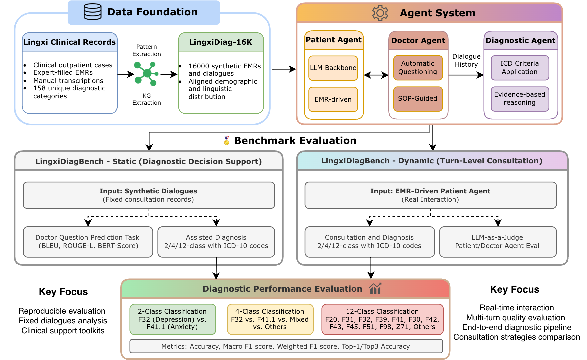

<div align="center">

<h1>
  🧠 LingxiDiagBench
</h1>

<p><strong>基于大语言模型医患智能体的精神疾病诊断综合评估基准</strong></p>

<p>
  
  
  
  
  <a href="https://huggingface.co/datasets/XuShihao6715/LingxiDiag-16k"></a>
  <a href="https://arxiv.org/abs/2602.09379"></a>
</p>

<p>
  <a href="README.md">English</a> | <a href="README_zh.md">简体中文</a>
</p>

</div>

---

## 📖 概述

**LingxiDiagBench** 是一个用于评估基于大语言模型的精神疾病诊断能力的综合评估基准。它提供静态（固定对话）和动态（实时交互）两种评估协议，支持对AI辅助诊断决策系统进行系统性评估。

<div align="center">
  
  <p><em>图：LingxiDiagBench 架构 - 数据基础、智能体系统与评估基准</em></p>
</div>

### 核心组件

| 组件 | 描述 |
|------|------|
| **[LingxiDiag-16K](https://huggingface.co/datasets/XuShihao6715/LingxiDiag-16k)** | 16,000条合成电子病历和对话，具有对齐的人口统计分布 |
| **LingxiDiagBench-Static** | 固定对话分析，用于诊断决策支持 |
| **LingxiDiagBench-Dynamic** | 基于EMR驱动的患者智能体的实时交互 |

### 评估任务

- **辅助诊断**: 2分类（抑郁 vs 焦虑）、4分类（+ 混合 + 其他）、12分类（ICD-10类别）
- **医生问题预测**: BLEU, ROUGE-L, BERTScore
- **LLM评判**: 临床适当性、医学伦理、评估质量
- **评估指标**: 准确率、宏平均F1、加权F1、Top-1/Top-3准确率

---

## 🚀 快速开始

### 环境要求

- **Python**: 3.10+
- **操作系统**: Linux / macOS / Windows
- **GPU**: 可选（本地VLLM部署需要）

### 安装步骤

#### 1. 克隆仓库

```bash
git clone https://github.com/Lingxi-mental-health/LingxiDiagBench.git
cd LingxiDiagBench
```

#### 2. 使用 uv 安装依赖

```bash
# 安装 uv（如果未安装）
pip install uv

# 如果在 conda 环境中，先退出
conda deactivate

# 创建虚拟环境
uv venv

# 激活虚拟环境
source .venv/bin/activate  # Linux/macOS
# 或
.venv\Scripts\activate     # Windows

# 验证环境
which python  # 应显示 .venv/bin/python
which pip     # 应显示 .venv/bin/pip

# 安装项目及依赖
uv pip install -e .

# 安装 vLLM
uv pip install vllm --torch-backend=auto
```

#### 3. 配置环境变量

```bash
# 复制环境变量模板
cp .env_example .env

# 编辑 .env 文件进行配置
```

关键环境变量：

```bash
# === OpenRouter API ===
OPENROUTER_API_KEY=sk-or-v1-your-key

# === DeepInfra API（用于RAG embedding）===
DEEPINFRA_API_KEY=your_deepinfra_api_key
USE_DEEPINFRA_EMBEDDING=true
DEEPINFRA_EMBEDDING_MODEL=Qwen/Qwen3-Embedding-8B
ENABLE_RERANKING=false
```

#### 4. 下载数据集

将 [LingxiDiag-16K](https://huggingface.co/datasets/XuShihao6715/LingxiDiag-16k) 数据集下载到 `raw_data/` 目录：

```bash
python scripts/huggingface_download.py \
    --repo-name "XuShihao6715/LingxiDiag-16k" \
    --output-dir "./raw_data" \
    --token "your_huggingface_token"
```

> **提示**：请将 `your_huggingface_token` 替换为你的 Hugging Face 访问令牌。也可以通过设置 `HF_TOKEN` 环境变量代替 `--token` 参数。

可用参数：

| 参数 | 说明 | 默认值 |
|------|------|--------|
| `--repo-name` | HF 仓库名称（必填） | — |
| `--output-dir` | 输出目录 | `./downloaded_data` |
| `--token` | HF 访问令牌（或设置 `HF_TOKEN` 环境变量） | `None` |
| `--split` | 下载指定分割：`train` / `validation` / `test` | 全部下载 |
| `--format` | 输出格式：`list` / `data_wrapper` / `lines` | `list` |
| `--no-mirror` | 禁用 hf-mirror 镜像加速 | 默认使用镜像 |

---

## 📚 Doctor V3（RAG增强版）前置准备

Doctor V3 使用 RAG（检索增强生成）进行循证问诊。在使用 Doctor V3 运行评估之前，需要先构建知识库。

### 1. 配置 DeepInfra API

```bash
export DEEPINFRA_API_KEY=your_deepinfra_api_key
export USE_DEEPINFRA_EMBEDDING=true
export DEEPINFRA_EMBEDDING_MODEL=Qwen/Qwen3-Embedding-8B
export ENABLE_RERANKING=false
```

### 2. 构建知识库

```bash
# 从临床指南PDF构建FAISS索引
python scripts/build_knowledge_base.py \
    --pdf knowledge_base/doc/疾病诊断指南.pdf \
    --output knowledge_base/indices/faiss_index
```

这将为问诊过程中的检索创建向量嵌入索引。

---

## 🔬 复现论文结果

### 评估脚本概览

| 脚本 | 用途 |
|------|------|
| `evaluation/batch_patient_eval.py` | 患者智能体评估（表3） |
| `evaluation/batch_doctor_eval.py` | 动态基准评估（表7） |
| `evaluation/unified_doctor_eval.py` | 静态基准评估（表4、5、6） |

### 表3：患者智能体评估

评估患者智能体在行为真实性各维度的质量。

```bash
bash run_patient_eval.sh
```

### 表4 & 5 & 6：LingxiDiagBench-Static（合成数据）

在 LingxiDiag-16K 合成数据集上评估AI辅助诊断。

```bash
bash run_static_benchmark.sh
```

### 表7：LingxiDiagBench-Dynamic

评估医生智能体与患者的实时交互。

```bash
bash run_doctor_eval.sh
```

---

## 📊 评估指标

### 分类指标

| 任务 | 指标 |
|------|------|
| 2分类 | 准确率、宏平均F1、加权F1 |
| 4分类 | 准确率、宏平均F1、加权F1 |
| 12分类 | 准确率、Top-1准确率、Top-3准确率、宏平均F1、加权F1 |

### LLM评判维度（1-6分）

| 维度 | 描述 |
|------|------|
| Clinical (Clin) | 问题的临床适当性 |
| Ethics (Eth) | 问诊过程中的医学伦理 |
| Assessment (Ass) | 症状评估质量 |
| Allround (All) | 话题的全面覆盖 |
| Completeness (Com) | 信息收集的完整性 |

### 患者智能体维度（1-5分）

| 维度 | 描述 |
|------|------|
| Accuracy | 对患者背景的遵循程度 |
| Honesty | 回答的真实性 |
| Brevity | 回答的简洁性 |
| Proactivity | 适当的主动性水平 |
| Restraint | 避免过多信息 |
| Polish | 自然语言质量 |

---

## 📁 项目结构

```
LingxiDiagBench/
├── src/                              # 源代码
│   ├── doctor/                       # 医生智能体
│   │   ├── doctor_base.py           # Free-form 医生
│   │   ├── doctor_v2.py             # Symptom-Tree 引导
│   │   └── doctor_v3.py             # APA-Guided + RAG
│   ├── patient/                      # 患者智能体
│   │   ├── patient_v3.py            # LingxiDiag-Patient
│   │   └── patient_mdd5k.py         # MDD-5K-Patient
│   ├── rag/                         # RAG 组件
│   │   ├── vector_store.py          # FAISS 向量存储
│   │   └── rag_config.py            # RAG 配置
│   └── llm/                         # LLM 工具
├── evaluation/                       # 评估脚本
│   ├── batch_doctor_eval.py         # 动态基准
│   ├── batch_patient_eval.py        # 患者评估
│   └── unified_doctor_eval.py       # 静态基准
├── scripts/                         # 工具脚本
│   ├── build_knowledge_base.py      # RAG 索引构建
│   └── huggingface_download.py      # 数据集下载
├── knowledge_base/                  # RAG 知识库
│   ├── doc/                         # 临床指南pdf
│   └── indices/                     # FAISS 索引
├── raw_data/                        # 数据集
│   └── LingxiDiag-16K_*.json       # 合成数据存放地址
├── prompts/                         # 提示词模板
│   ├── doctor/                      # 医生提示词
│   ├── patient/                     # 患者提示词
│   └── diagtree/                    # 诊断树
└── doc/                             # 文档
    └── Benchmark_structure.pdf      # 架构图
```

---

## ⚙️ 配置说明

### 模型配置

```bash
# === 本地 VLLM 模型 ===
# 格式：ModelName@IP:PORT
OFFLINE_DOCTOR_MODEL=Qwen3-32B
OFFLINE_DOCTOR_PORTS=9040
VLLM_DOCTOR_IP=10.119.16.100

# === OpenRouter API ===
OPENROUTER_API_KEY=sk-or-v1-your-key
OPENROUTER_DOCTOR_MODEL=google/gemini-3-flash-preview
```

### 医生策略

| 策略 | 版本参数 | 描述 |
|------|----------|------|
| Free-form | `--doctor-version base` | LLM驱动的自由问诊 |
| Symptom-Tree | `--doctor-version v2` | 结构化诊断树引导 |
| APA-Guided | `--doctor-version v3` | RAG增强 + 临床指南 |

### 患者版本

| 版本 | 参数 | 描述 |
|------|------|------|
| LingxiDiag-Patient | `--patient-version v3` | 优化的患者模拟 |
| MDD-5K-Patient | `--patient-version mdd5k` | 原始MDD-5K格式 |

---

## 📖 引用

如果您在研究中使用了 LingxiDiagBench，请引用我们的论文：

```bibtex
@misc{xu2026lingxidiagbench,
  title={LingxiDiagBench: A Multi-Agent Framework for Benchmarking LLMs in Chinese Psychiatric Consultation and Diagnosis},
  author={Shihao Xu and Tiancheng Zhou and Jiatong Ma and Yanli Ding and Yiming Yan and Ming Xiao and Guoyi Li and Haiyang Geng and Yunyun Han and Jianhua Chen and Yafeng Deng},
  year={2026},
  eprint={2602.09379},
  archivePrefix={arXiv},
  primaryClass={cs.MA}
}
```

---

## 📄 许可证

本项目采用 [CC BY-NC 4.0](LICENSE) 许可证。

---

<div align="center">

**如果这个项目对您有帮助，请给我们一个 ⭐️**

Made with ❤️ by the Evermind Lingxi Team from Shanda Group

Join us here: https://evermind.ai/careers

</div>
